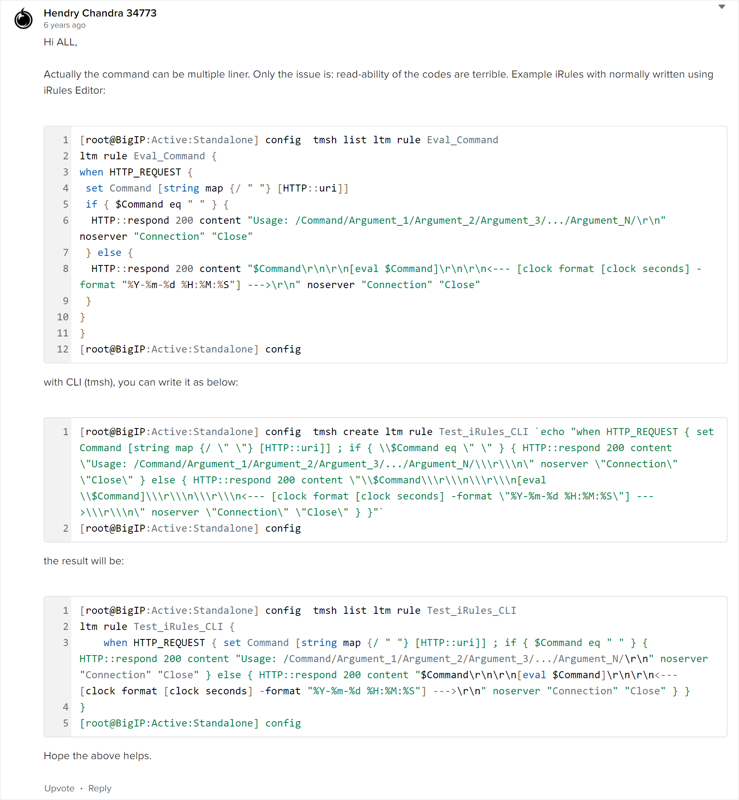

# Compose iRule from TMSH


From [DevCentral](https://devcentral.f5.com/s/feed/0D51T00006i7WpwSAE):

Hi ALL,

Actually the command can be multiple liner. Only the issue is: read-ability of the codes are terrible. Example iRules with normally written using iRules Editor:

```
[root@BigIP:Active:Standalone] config  tmsh list ltm rule Eval_Command
ltm rule Eval_Command {
when HTTP_REQUEST {
 set Command [string map {/ " "} [HTTP::uri]]
 if { $Command eq " " } {
  HTTP::respond 200 content "Usage: /Command/Argument_1/Argument_2/Argument_3/.../Argument_N/\r\n" noserver "Connection" "Close"
 } else {
  HTTP::respond 200 content "$Command\r\n\r\n[eval $Command]\r\n\r\n<--- [clock format [clock seconds] -format "%Y-%m-%d %H:%M:%S"] --->\r\n" noserver "Connection" "Close"
 }
}
}
[root@BigIP:Active:Standalone] config 
```

with CLI (tmsh), you can write it as below:

```
[root@BigIP:Active:Standalone] config  tmsh create ltm rule Test_iRules_CLI `echo "when HTTP_REQUEST { set Command [string map {/ \" \"} [HTTP::uri]] ; if { \\$Command eq \" \" } { HTTP::respond 200 content \"Usage: /Command/Argument_1/Argument_2/Argument_3/.../Argument_N/\\\r\\\n\" noserver \"Connection\" \"Close\" } else { HTTP::respond 200 content \"\\$Command\\\r\\\n\\\r\\\n[eval \\$Command]\\\r\\\n\\\r\\\n<--- [clock format [clock seconds] -format \"%Y-%m-%d %H:%M:%S\"] --->\\\r\\\n\" noserver \"Connection\" \"Close\" } }"`
[root@BigIP:Active:Standalone] config 
```
the result will be:


```
[root@BigIP:Active:Standalone] config  tmsh list ltm rule Test_iRules_CLI
ltm rule Test_iRules_CLI {
    when HTTP_REQUEST { set Command [string map {/ " "} [HTTP::uri]] ; if { $Command eq " " } { HTTP::respond 200 content "Usage: /Command/Argument_1/Argument_2/Argument_3/.../Argument_N/\r\n" noserver "Connection" "Close" } else { HTTP::respond 200 content "$Command\r\n\r\n[eval $Command]\r\n\r\n<--- [clock format [clock seconds] -format "%Y-%m-%d %H:%M:%S"] --->\r\n" noserver "Connection" "Close" } }
}
[root@BigIP:Active:Standalone] config 
```
Hope the above helps.



A few steps which hopefully can help (may NOT cover ALL possible cases):

- [ ] Optimize the iRules first
- [ ] Remove ALL Comments
- [ ] Optionally, remove ALL unnecessary white spaces
- [ ] Do NOT use character `!` in your iRules. Replace it with `not ( )`
- [ ] Replace the following characters<br>
      `$` to be replaced with `\\$`<br>
      `"` to be replaced with `\\"`<br>
      New Line character (usually represented with `\n` or `\r\n` to be replaced with ` ; ` (space, semicolon, space)


There are some other information (other way) from DevCentral, but it does not seem to work anymore.


<br><br><br>
```
╔═╦═════════════════╦═╗
║ ║                 ║ ║
╠═╬═════════════════╬═╣
║ ║ End of Document ║ ║
╠═╬═════════════════╬═╣
║ ║                 ║ ║
╚═╩═════════════════╩═╝
```
<br><br><br>


